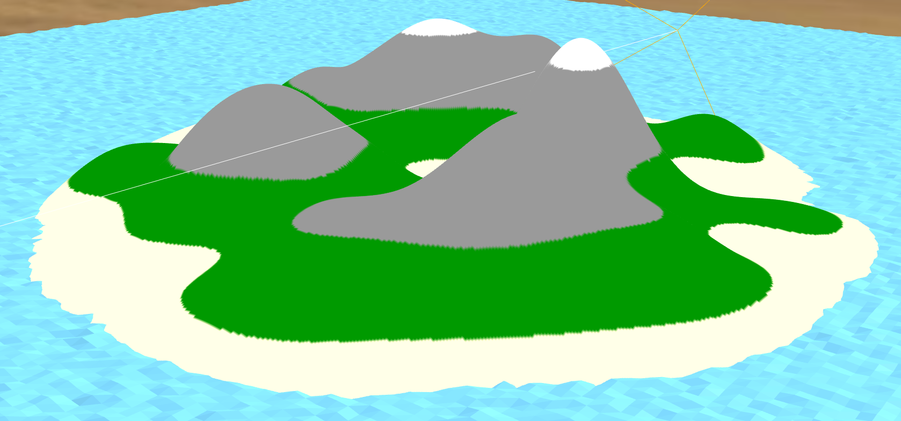

# a-island
Procedural island for A-Frame

## Example



```html
<a-scene>
  <a-entity camera="userHeight=1.6" wasd-controls="fly: true" position="0 20 100"></a-entity>
  <a-sky src="sky.jpg"></a-sky>
  <a-ocean density="250" opacity="1.0" position="0 -1 0" width="500" depth="500"></a-ocean>
  <a-entity position="0 -2 0" a-island="size:1024; height: 10; density: 10"></a-entity>
</a-scene>
```
